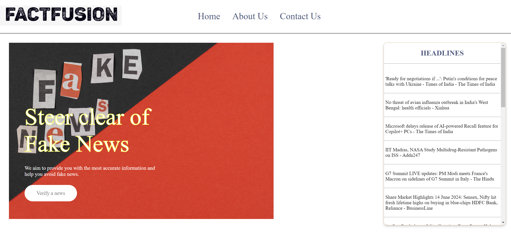

<div align="center">
  <br />
      
  <br />
</div>


### Clone the repository and navigate to the project directory
```bash
git clone  ////////idhar lnk daalna hai//////////
cd FactFusion
```

### Installation with poetry (option 1)
1. Install Poetry by following it [installation guideline](https://python-poetry.org/docs/).
2. Install all dependencies by running:
```bash
poetry install
```

### Installation with pip (option 2)
1. Create a Python environment at version 3.9 or newer and activate it.

2. Navigate to the project directory and install the required packages:
```bash
pip install -r requirements.txt
```

### Configure API keys

You can choose to export essential api key to the environment

- Example: Export essential api key to the environment
```bash
export SERPER_API_KEY=... # this is required in evidence retrieval if serper being used
export OPENAI_API_KEY=... # this is required in all tasks
```

Alternatively, you configure API keys via a YAML file, see [user guide](docs/user_guide.md) for more details.

A sample test case:
<div align="center">
	
</div>

## Usage

The main interface of Loki fact-checker located in `factcheck/__init__.py`, which contains the `check_response` method. This method integrates the complete fact verification pipeline, where each functionality is encapsulated in its class as described in the Features section.

#### Used as a Library

```python
from factcheck import FactCheck

factcheck_instance = FactCheck()

# Example text
text = "Your text here"

# Run the fact-check pipeline
results = factcheck_instance.check_response(text)
print(results)
```

#### Used as a Web App
```bash
python webapp.py --api_config demo_data/api_config.yaml
```

#### Multimodal Usage

```bash
# String
python -m factcheck --modal string --input "MBZUAI is the first AI university in the world"
# Text
python -m factcheck --modal text --input demo_data/text.txt
# Speech
python -m factcheck --modal speech --input demo_data/speech.mp3
# Image
python -m factcheck --modal image --input demo_data/image.webp
# Video
python -m factcheck --modal video --input demo_data/video.m4v
```


<div align="center">
	
</div>

